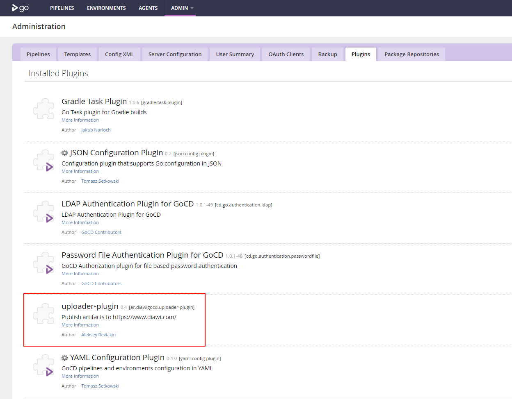
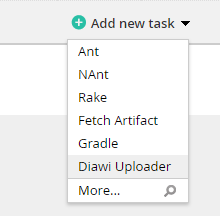
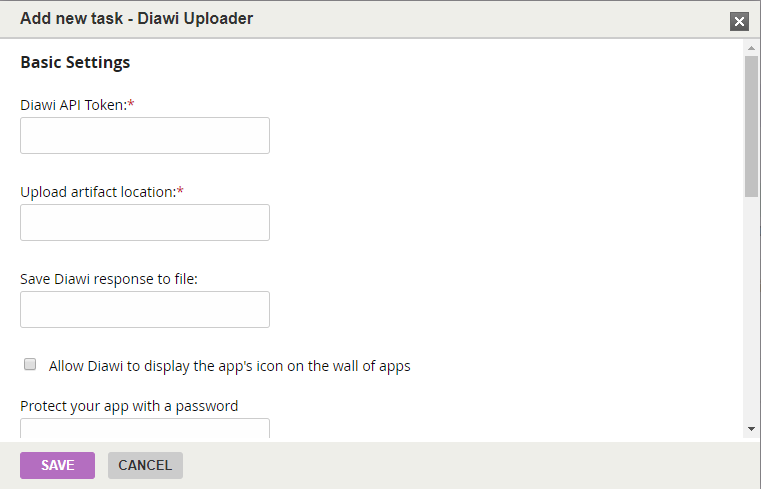

# diawi-upload-plugin

# Description
Plugin for uploading [GoCD](https://www.gocd.org/) generated artifacts to [Diawi](https://www.diawi.com/) service.

# Installation
* Place [uploader-plugin.jar](dist/uploader-plugin.jar) to GoCD server `/plugins/external` folder
* Start/Restart GoCD server
* Check that plugin present in GoCD server Admin/Plugins menu


# Usage
* Add Diawi Uploader task to GoCD job configuration


* Configure plugin properties


## Configuration parameters

Name | Description | Required | Example
---- | ----------- | -------- | -------
Diawi API Token | API token for access Diawi APIs | :heavy_check_mark: | TOKEN
Upload artifact location | Local GoCD Artifact that would be uploaded to Diawi | :heavy_check_mark: | app/build/outputs/apk/app-debug.apk
Save Diawi response to file | When Diawi upload completed, response link could be saved as local file to produce GoCD Artifact |  | app/build/outputs/apk/diawi-link.txt

## Diawi service specific parameters

Name | Description | Diawi API mapping
---- | ----------- | -----------------
Allow Diawi to display the app's icon on the wall of apps | allow Diawi to display the app's icon on the wall of apps | wall_of_apps
Protect your app with a password | protect your app with a password: it will be required to access the installation page | password
Additional information to your users on this build | additional information to your users on this build: the comment will be displayed on the installation page | comment
The URL Diawi should call with the result | (URL as string): the URL Diawi should call with the result | callback_url
The email addresses Diawi will send the result | the email addresses Diawi will send the result to (up to 5 separated by commas for starter/premium/enterprise accounts, 1 for free accounts) | callback_emails 
Allow your testers to find the app on Diawi's mobile web app using their UDID | allow your testers to find the app on Diawi's mobile web app using their UDID (iOS only) | find_by_udid 
Receive notifications each time someone installs the app | receive notifications each time someone installs the app (only starter/premium/enterprise accounts) | installation_notifications

# Build
 ```bash
 mvn package
```